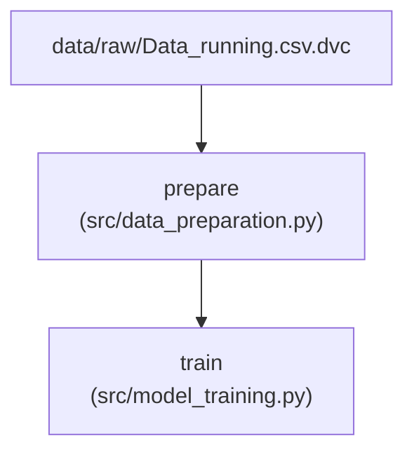

# REKOMENDASI PROGRAM LATIHAN LARI BERBASIS AI

Proyek Akhir Data Mining - Sistem cerdas untuk merekomendasikan jadwal latihan lari. Sistem ini menggabungkan prediksi **Machine Learning (Random Forest)** dengan logika medis olahraga **Rule-Based (Hal Higdon & Jack Daniels VDOT)**.

## Arsitektur MLOps (DAG)
Proyek ini menggunakan DVC untuk memisahkan alur *Data Engineering* dan *Model Training*. Berikut adalah alur pipeline-nya:

